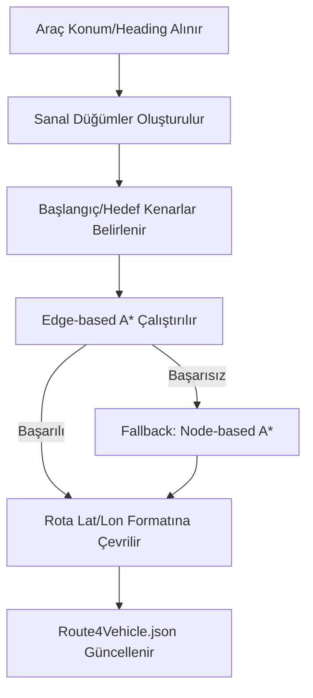

# A* Entegrasyonu ve Rota Servisi

Sistem, araçların depoda bulunmadığı saha senaryolarında, gerçek zamanlı konumlarından hedefe (depo veya müşteri) giden en uygun rotayı hesaplamak için A* tabanlı bağımsız bir mikroservis kullanır.

## Rota Servisi (Routing Microservice)

Bu servis, SUMO simülasyonuna bağımlı olmadan çalışır ve **OSMnx + NetworkX** tabanlı yol grafiği altyapısını kullanır.

### Mimari Bileşenler
- **app.py:** Flask tabanlı servis giriş noktası.
- **graph_manager.py:** Yol ağını (GraphML, SUMO net veya OSMnx) yönetir.
- **osmnx_astar_edge_based.py:** Kenar tabanlı A* algoritma çekirdeği.
- **routing.py:** Sanal düğüm (virtual node) ve A* çağrılarını koordine eder.

## Kenar Tabanlı (Edge-Based) Yaklaşım

Klasik düğüm tabanlı (node-based) yönlendirme yerine kenar tabanlı bir yaklaşım tercih edilmiştir.
- **Neden?** Kavşaklarda aracın geliş yönünü dikkate alarak daha gerçekçi manevralar üretmek için.
- **State Yönetimi:** Her bir kenar (u, v, key) ayrı bir durum olarak ele alınır.
- **Heuristik Fonksiyon:** Kenar merkezleri arasındaki **Haversine mesafesi**, yolun maksimum hızına bölünerek "tahmini seyahat süresi" cinsinden hesaplanır.

## Sanal Düğüm (Virtual Node) Mantığı

Gerçek araçlar genellikle bir kavşak noktasında değil, yolun ortasında bulunur. Bu sorunu çözmek için:
1.  Aracın koordinatına en yakın kenarlar tespit edilir.
2.  Graf üzerine geçici (virtual) düğümler eklenir.
3.  Aracın hareket yönü (heading) bilgisi kullanılarak, ters yöne dönmesi engellenir (`choose_edge_by_bearing`).

## Rota Hesaplama Akışı

## Frontend Entegrasyonu

### SUIT Frontend
- Araç depoda değilse otomatik olarak A* hesaplama isteği gönderir.
- Hesaplanan rota `astar_applied` bayrağı ile işaretlenir ve haritada özel ikonlarla gösterilir.

### OPEVA Frontend
- Kullanıcıya hedef seçimi sunar: **Depo** veya **İlk Müşteri**.
- Eğer hedef "İlk Müşteri" seçilirse, araç depoda olsa dahi dinamik rota hesaplaması tetiklenir.
