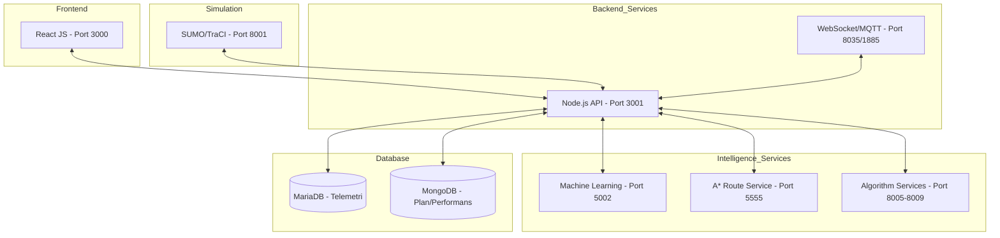

# Sistem Mimarisi

Filo Yönetimi Uygulaması, mikroservis mimarisine yakın, çok katmanlı ve modüler bir yapıda tasarlanmıştır.

## Genel Mimari Şeması

Sistem bileşenleri arasındaki veri akışı ve port yapılandırması aşağıda özetlenmiştir:

## Teknoloji Yığını

### Sunum Katmanı (Frontend)
- **Framework:** React.js
- **Harita:** Leaflet / OpenStreetMap
- **Grafik:** Recharts (SHAP ve performans analizleri için)
- **İletişim:** REST API ve WebSocket (Socket.io)

### Uygulama Katmanı (Backend)
- **Ana API:** Node.js / Express.js
- **Veri Toplama:** MQTT Broker (Mosquitto)
- **Protokol Entegrasyonu:** FIWARE Context Broker

### Zeka ve Optimizasyon Katmanı
- **Algoritmalar:** Python / Flask
- **ML Frameworks:** PyTorch (LSTM), CatBoost, H2O AutoML
- **Optimizasyon:** Google OR-Tools, Custom ALNS implementasyonu
- **Graf Yönetimi:** OSMnx + NetworkX

### Veri Katmanı
- **MariaDB:** Araç telemetrisi ve FIWARE'den gelen anlık konum verileri için.
- **MongoDB Atlas:** Rota planları, müşteri bilgileri, performans raporları ve sistem ayarları için.

## Veri Akış Özeti

1.  **Gerçek Araç Verisi:** Araç sensörlerinden gelen veriler MQTT üzerinden FIWARE protokolüyle alınır ve MariaDB'ye kaydedilir.
2.  **Simülasyon Verisi:** SUMO üzerinden üretilen trafik ve araç hareketleri TraCI arayüzü ile API katmanına aktarılır.
3.  **Rota Talebi:** Kullanıcı arayüzünden seçilen parametrelerle optimizasyon servisi tetiklenir, sonuçlar `Route4Vehicle.json` formatında kaydedilir.
4.  **Tahmin Süreci:** Makine öğrenmesi modülü, geçmiş telemetri verilerini kullanarak menzil ve enerji tüketimi tahmini yapar.
5.  **Görselleştirme:** Tüm veriler (konum, rota, tahminler, uyarılar) React tabanlı arayüzde harita ve grafikler üzerinden sunulur.
