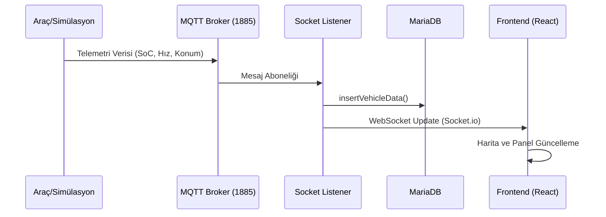

# Araç İzleme (Fleet Monitoring)

Araç İzleme modülü, elektrikli araç filosunun gerçek zamanlı izlenmesini ve simülasyon tabanlı kontrolünü sağlayan merkezi operasyon panelidir.

## Temel İşlevler

Bu modül, filo yöneticisine operasyonun anlık durumunu gösteren dört ana fonksiyon sunar:

### 1. Gerçek Zamanlı Takip
- **Hibrit Gösterim:** FIWARE üzerinden gelen gerçek araç verileri ile SUMO simülasyonu üzerinden gelen sanal araç verileri aynı harita üzerinde gösterilir.
- **Yön Hesaplama:** Araçların anlık hareket yönleri (bearing) otomatik olarak hesaplanarak harita ikonlarına yansıtılır.
- **Rota Çizimi:** Araçların hem planlanan rotaları hem de o ana kadar gerçekleştirdikleri (actual path) hareketleri görselleştirilir.

### 2. Uyarı Yönetimi (Fleet Alerts)
Sistem, araçlardan gelen verileri analiz ederek kritik durumları raporlar:
- **Batarya:** %20 altı kritik, %30 altı uyarı seviyesi.
- **Yük:** Araç kapasitesini aşan (örn. >1200kg) durumlar.
- **Sıcaklık:** Motor veya batarya hücrelerindeki aşırı ısınma (>30°C kritik).
- **Hız ve Menzil:** Hız limit aşımları ve menzil yetersizliği uyarıları.

### 3. Performans İzleme
- **Enerji Tüketimi:** Seçili araç veya rota için tahmini enerji tüketim grafikleri sunulur.
- **SoC Tahminleri:** LSTM modelleri kullanılarak aracın batarya durumunun gelecek periyotlardaki değişimi tahmin edilir.
- **SHAP Analizi:** Enerji tüketimini etkileyen faktörler (eğim, hız, yük vb.) açıklanabilir yapay zeka çıktıları ile analiz edilir.

### 4. A* Rota Hesaplama
- Araç depoda değilse, mevcut konumundan depoya veya bir sonraki müşteriye giden dinamik rotalar A* algoritması ile anlık olarak hesaplanabilir.

## Veri Akış Modeli

## Araç Kimlik Eşleştirmesi (Mapping)
SUMO simülasyonundaki araç kimlikleri ile FIWARE sistemindeki kimlikler arasında otomatik bir eşleştirme yapılır:
- `veh0` → `musoshi004`
- `veh1` → `musoshi005`
- ... ve benzeri.
