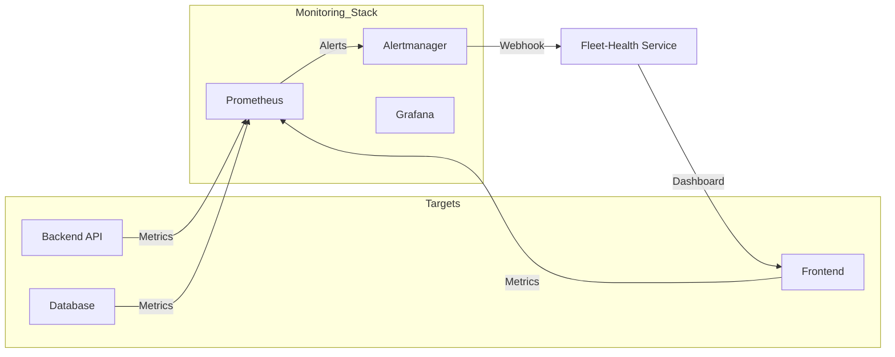

# Sağlık İzleme (Health Monitoring)

Sistem, profesyonel SRE (Site Reliability Engineering) standartlarında bir sağlık izleme altyapısına sahiptir. Bu altyapı, tüm mikroservislerin durumunu ve ağ trafiğini anlık olarak takip eder.

## Sistem Genel Bakış

İzleme sistemi 6 kritik servisi ve ağ bileşenini denetler:
- Backend & Frontend
- MariaDB & MongoDB
- MQTT Broker
- Docker Konteynerları
- Sunucu Donanımı (CPU, RAM, Disk)

## İzleme Mimarisi

## İki Aşamalı Kazıma (Two-Tier Scraping)

Prometheus kaynak tüketimini optimize etmek için sistem iki farklı modda çalışır:
1.  **Always-on (Standart):** Temel metrikler (çalışma durumu, hata oranları) 60 saniyede bir çekilir.
2.  **Debug (Hata Ayıklama):** Bir olay (incident) anında otomatik olarak devreye girer. Yüksek detaylı metrikleri (histogramlar, bucket'lar) 15 saniye aralıklarla çekmeye başlar.

## Önemli Alarm Tanımları

Sistemde tanımlı 70'den fazla alarmdan bazı kritik örnekler:

| Servis | Alarm Adı | Tetikleme Koşulu |
| :--- | :--- | :--- |
| **Backend** | `Backend_Up` | Servis 1 dakikadan uzun süre yanıtsız kalırsa. |
| **MariaDB** | `MariaDB_Slow_Queries` | Sorgu süresi 0.05s eşiğini aşarsa. |
| **Docker** | `Docker_OOM_Kill` | Bir konteyner bellek yetersizliği nedeniyle durursa. |
| **Frontend** | `Frontend_App_Load_Time_High` | Sayfa yükleme süresi 3 saniyeyi aşarsa. |

## Operasyonel Müdahale

- **Grafana Dashboard:** Sistem performansının tarihsel analizi için kullanılır.
- **AlertBar:** Kullanıcı arayüzünün üst kısmında yer alan ve kritik alarmları anlık olarak gösteren etkileşimli alan.
- **Debug Scrape Controller:** Hata anında detaylı metriklerin toplanmasını koordine eden Python tabanlı otomasyon servisi.
